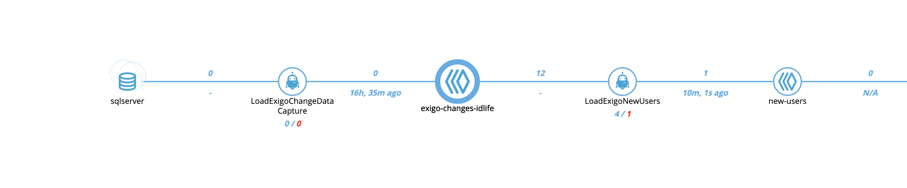
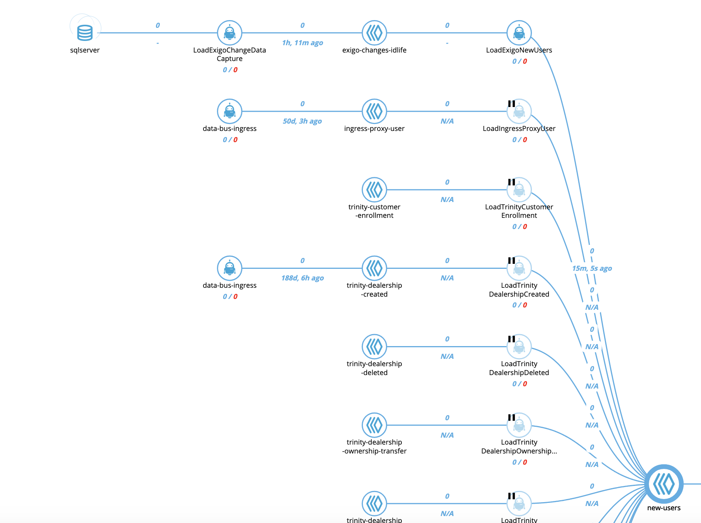

# Exigo Change Detection Pipeline





# Brief Introduction to table changes

These bots are based on `change detection` which is a very database specific.  Most database operations are common among all databases, except for this feature.  Leo has created a special connector for every database [connectors](https://github.com/LeoPlatform/connectors) it supports.  

# Microsoft Sql Server and Leo

This bot is Mssql specific, so the [sqlserver connector](https://github.com/LeoPlatform/connectors/tree/master/sqlserver) is required.  In there contains instructons on how to activate `change detection`.  To be complete, the same instruction will be mentioned here, but do check in once and a while on the main site for changes and updates.  The Leo connector contains business logic to maintain state and some eye candy in Botmon out-of-box, so no extra configuration is required.  Simply setting the table and keys are necessary.  

```
const db = require('leo-connector-sqlserver')
```

This bot should only contain 1 table.  The state management feature persists the current change version inside the checkpoint.  Versions are at the table level. The connector queries the latest version which contains the latest changes.  The connector then will record this checkpoint.  The cycle then starts over.   Here is an example of a typical request made by the connector:

```
SELECT 'users' as tableName, Personid, SYS_CHANGE_VERSION __SYS_CHANGE_VERSION
FROM  CHANGETABLE(CHANGES users, 0) AS CT
where SYS_CHANGE_VERSION > 0 OR (SYS_CHANGE_VERSION = 0 AND Personid > 0)
```

# Local Testing

### FullStack Setup Script

The following will bring up a local Microsoft Sql Server instance on port 1433.  It will also create the schemas as well as
seed the database. 

```
./local up fullstack -d

docker ps

```

### Setup Azure Studio

Download and install [Azure Studio](https://docs.microsoft.com/en-us/sql/azure-data-studio/download?view=sql-server-2017) for free. 

```
... from Gitlab => galactic-empire.exigo
Host: mssql
Username : sa
Password : P@ssword1
Port : 1433
```


### Sample Change Detection

Here is an example of how mssql server enables change detection.

```
ALTER DATABASE exigo
SET CHANGE_TRACKING = ON
(CHANGE_RETENTION = 7 DAYS, AUTO_CLEANUP = ON)

ALTER TABLE customers
ENABLE CHANGE_TRACKING
WITH (TRACK_COLUMNS_UPDATED = OFF)

/* See All tables with Change tracking enabled. */
SELECT so.name AS trackedTable
FROM sys.internal_tables it
INNER JOIN sys.dm_db_partition_stats ps ON ps.object_id = it.object_id
LEFT JOIN sys.objects so ON so.object_id = it.parent_object_id
WHERE it.internal_type IN (209, 210)
AND ps.index_id < 2
AND so.name IS NOT NULL

```

### Local Testing

Edit `package.json` and hard-code values here:

```
"GITLAB_SECRET": "ABC123",
"GITLAB_URL": "<current_url>"
```

```
  leo-cli test . -e local
```

When local testing, the bot pulls the exigo configuration from Gitlab like it will in production, so make sure your database username and password matches.

# Exigo Customer Changes

Change detection happens at the table level.  Currently, we have to track the following tables.

1. Customer
2. CodedRanks
3. CustomerSites
4. EnrollerTree
5. UnilevelTree

The change detection on these tables will converge into one queue

* exigo-customer-changes


